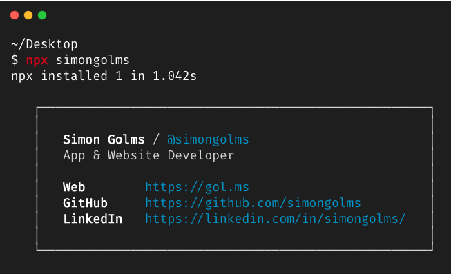

# Personal Card

This is my personal digital business card.

[](https://badge.fury.io/js/simongolms)

<p align="center">
  
</p>

## Usage

Open your terminal and run:

```shell
npx simongolms
```

## Inspiration

I was inspired to create this digital business card by [@bitandbang](https://github.com/bnb/bitandbang) and [@mixn](https://github.com/mixn/milos). It's such a cool idea to run a simple `npx` command and get info about me and where to find my work. Plus, I doubt anyone will ever want to write an npm package called `simongolms`, so I figured I wasn't being irresponsible.

## License

MIT © Simon Golms
